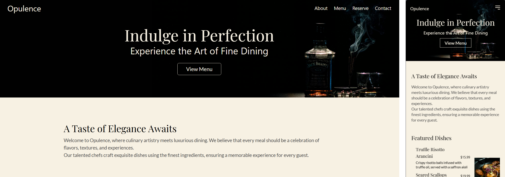

<h1>Description</h2>

Opulence is a web application that allows users to view the menu and make online reservations at a restaurant. It streamlines the dining experience by providing essential information about available dishes and booking options.
<h2>Project website URL </h2>
https://sameersharmadev.github.io/opulence/
 

<h2>Project Features</h2>

+ <h4>User friendly interface</h4>
  Built with a clean design that prioritizes simplicity and easy navigation, making it straightforward for users to browse the menu and make reservations.
+ <h4>Responsivene and clean design</h4>
  The layout adapts across all devices, providing an optimal experience on mobile, tablet, and desktop.
+ <h4>Optimized for production</h4>
  CSS and JS are fully optimized for production, i.e  the code is minified, and TailwindCSS is purged
  <h4> #Note for Javascript and CSS code</h4>
  The JavaScript and CSS in this project is minified to improve loading performance. If you'd like to view the full source code, you can use a deminifier tool or a browser's built-in "Pretty Print" option in the developer tools.

<h2>Section breakdown</h2>

+ <h3>Home</h3>
  The homepage was designed to provide a smooth user experience while guiding visitors towards the call to action (CTA). Here's a breakdown of its structure:

  + <b>Hero section:</b> The hero section is carefully crafted to immediately capture attention. A bold headline, engaging imagery, and a prominent CTA button are strategically placed to draw users in and encourage them to explore the menu.

  + <b>Featured section:</b> Consists of the most popular signature dishes for the restaurant along with an option to view the full menu.
    
  + <b>Location and Time:</b> Consists of the location of the restaurant in an embedded map, along with information about open hours, and a CTA to make reservation.
    
  + <b>FAQs:</b> The frequently asked questions (FAQs) section addresses common concerns in an easy-to-navigate format, ensuring visitors can find answers without hassle.
 
+ <h3>About</h3>
  The About us section is thoughtfully designed to convey the goals, vision, and journey. It includes:

  + <b>Overview:</b> This section outlines details and purpose behind Opulence.
  
  + <b>Our Story:</b> A dedicated segment shares the origin of Opulence, highlighting the motivation and values that drive the platform.
  + <b>Our Values:</b> Describes the working philosophy at Opulence, explaining how the meals are prepared hygienically and with utmost care.

  + <b>Meet Our Team:</b> This section introduces the core team behind Opulence, giving a personal touch by sharing roles and contributions.
    
+ <h3>Contact</h3>
  The Contact Page is designed as a short popup form that allows users to easily submit their information, queries, and feedback. This section focuses on helping users connect with the team effortlessly, enhancing user support and engagement.

+ <h3>Reservation</h3>
  The reservation Page is designed to let the user enter the details such as contact information, guest number, date and time, to book a seat in advance.

<h2>Technologies used</h2>

+ HTML, CSS, Javascript
+ TailwindCSS, SCSS
+ Other Tools: Font awesome

